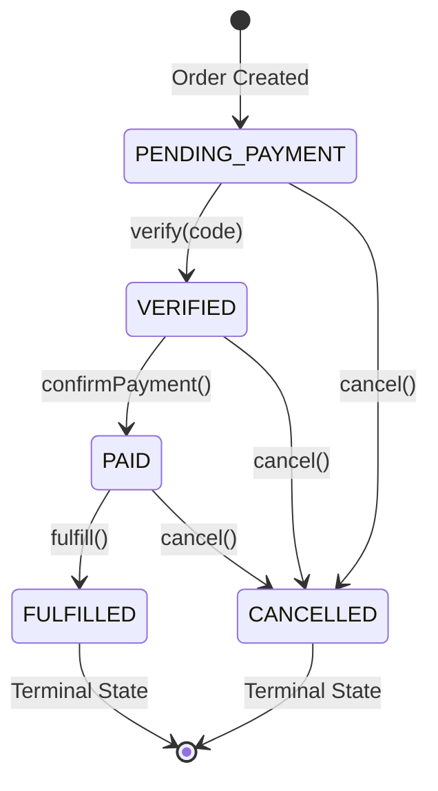

# Production-Grade Order State Machine

This implementation provides a robust, race-condition-free order management system with guaranteed state integrity and proper inventory handling.

## 🎯 Design Goals

- **Data Integrity**: Invalid state transitions are impossible
- **Race Condition Prevention**: Transaction isolation prevents concurrent modification issues
- **Inventory Safety**: Proper reservation/deduction prevents overselling
- **Audit Trail**: Complete history of all state changes
- **Business Logic Enforcement**: Only valid operations are allowed

## 📊 State Machine Overview



## 🔄 Valid State Transitions

| From → To | PENDING_PAYMENT | VERIFIED | PAID | FULFILLED | CANCELLED |
|-----------|----------------|----------|------|-----------|-----------|
| PENDING_PAYMENT | ❌ (no-op) | ✅ verify | ❌ | ❌ | ✅ cancel |
| VERIFIED | ❌ | ❌ (no-op) | ✅ pay | ❌ | ✅ cancel |
| PAID | ❌ | ❌ | ❌ (no-op) | ✅ fulfill | ✅ cancel |
| FULFILLED | ❌ | ❌ | ❌ | ✅ (no-op) | ❌ |
| CANCELLED | ❌ | ❌ | ❌ | ❌ | ✅ (no-op) |

## 🏪 Inventory Management

- **PENDING_PAYMENT/VERIFIED**: Inventory **RESERVED** (temporary hold)
- **PAID/FULFILLED**: Inventory **DEDUCTED** (permanent removal)
- **CANCELLED**: Reservation **RELEASED** (inventory restored)

## 🚀 API Endpoints

### Order Retrieval
```http
GET /api/orders/{orderId}           # Get specific order
GET /api/orders                     # Get provider's orders
GET /api/orders/status/{status}     # Get orders by status
```

### State Transitions
```http
POST /api/orders/{orderId}/verify           # Verify with code
POST /api/orders/{orderId}/confirm-payment  # Confirm payment
POST /api/orders/{orderId}/fulfill          # Mark fulfilled
POST /api/orders/{orderId}/cancel           # Cancel order
```

### Request Examples

**Verify Order:**
```json
POST /api/orders/123e4567-e89b-12d3-a456-426614174000/verify
Headers: X-Provider-ID: provider-uuid
{
  "verificationCode": "ABC123"
}
```

**Confirm Payment:**
```json
POST /api/orders/123e4567-e89b-12d3-a456-426614174000/confirm-payment
Headers: X-Provider-ID: provider-uuid
{
  "paymentMethod": "cash",
  "paymentNotes": "Paid in person at pickup"
}
```

**Fulfill Order:**
```json
POST /api/orders/123e4567-e89b-12d3-a456-426614174000/fulfill
Headers: X-Provider-ID: provider-uuid
{
  "fulfillmentNotes": "Delivered successfully"
}
```

**Cancel Order:**
```json
POST /api/orders/123e4567-e89b-12d3-a456-426614174000/cancel
Headers: X-Provider-ID: provider-uuid
{
  "cancelNotes": "Customer didn't show up"
}
```

## 🔒 Security & Authorization

- All operations require `X-Provider-ID` header
- Providers can only access their own orders
- State machine prevents unauthorized operations
- Verification codes are unique and one-time use

## 🧪 Testing

Run the comprehensive test suite:
```bash
mvn test -Dtest=OrderStateMachineTest
```

Tests cover:
- ✅ All valid state transitions
- ❌ All invalid transition rejections
- 🔄 Business logic validation
- 🏪 Inventory state management
- 🚫 Terminal state behavior

## 🏗️ Architecture Components

### OrderStatus Enum
- Defines all valid states
- Enforces transition rules
- Provides state queries

### Order Entity
- JPA entity with state machine integration
- Business methods for state transitions
- Audit trail tracking

### OrderService
- Orchestrates state transitions
- Manages transactions and inventory
- Publishes events

### OrderController
- REST API endpoints
- Request validation
- Error handling

### OrderRepository
- Optimized database queries
- Provider authorization
- Aggregation queries

## 🚨 Error Handling

The API returns appropriate HTTP status codes:

- `400 Bad Request`: Invalid transitions, wrong verification codes
- `403 Forbidden`: Unauthorized provider access
- `404 Not Found`: Order not found
- `500 Internal Server Error`: Inventory or system errors

Error response format:
```json
{
  "errorCode": "INVALID_TRANSITION",
  "message": "Invalid order status transition: PENDING_PAYMENT → PAID"
}
```

## 🔧 Integration Points

### InventoryService
Implement this interface for your inventory system:
```java
public interface InventoryService {
    void reserveInventory(UUID listingId, int quantity);
    void releaseReservation(UUID listingId, int quantity);
    void deductInventory(UUID listingId, int quantity);
    boolean isInventoryAvailable(UUID listingId, int quantity);
}
```

### OrderEventPublisher
Extend this for notifications and analytics:
```java
public class OrderEventPublisher {
    void publishOrderVerified(Order order);
    void publishPaymentConfirmed(Order order);
    void publishOrderFulfilled(Order order);
    void publishOrderCancelled(Order order);
}
```

## 📈 Production Considerations

1. **Database Indexes**: All queries are optimized with proper indexes
2. **Transaction Isolation**: Uses READ_COMMITTED to prevent dirty reads
3. **Audit Logging**: Complete history of state changes
4. **Monitoring**: Event publishing for observability
5. **Scalability**: Stateless design, database-bound operations
6. **Data Consistency**: State machine prevents invalid data states

## 🎯 Business Benefits

- **Prevents Fraud**: Verification system ensures meetup integrity
- **Eliminates Overselling**: Proper inventory management
- **Reduces Disputes**: Clear audit trail and state history
- **Improves UX**: Clear status progression for all parties
- **Enables Analytics**: Event-driven architecture for insights

This state machine design provides enterprise-grade reliability while maintaining simplicity and clear business logic.